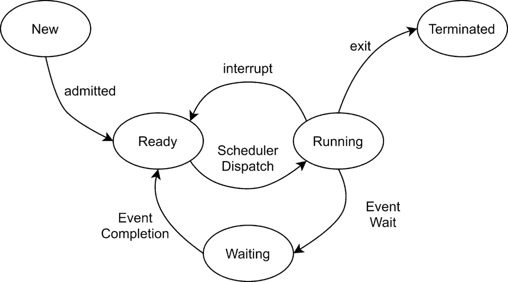
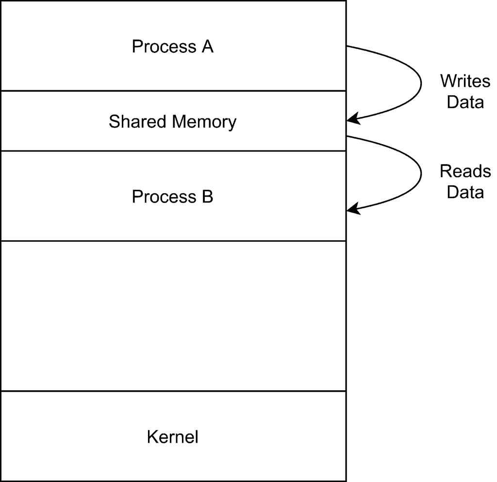
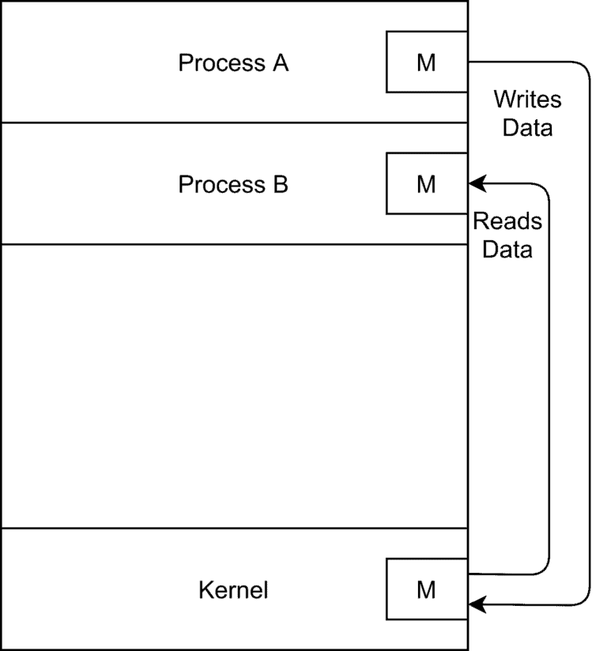

# Inter Process Communication

## What is a Process?

- A program when in execution is a process. However, a program is more than the program source code.
- A process is an active entity that contains various additional components other than the program source code, 
- A process contains a process stack to store the temporary data such as function parameters, local variables, etc, a data section to store global variables, a heap memory allocated dynamically at run time. 

## Process Control Block

- A Process Control Block represents a process in the operating system. 
- A process control block contains various information related to a process such as a process state, program counter, program counterm CPU register details, memory management information, etc. 
- It acts as a repository that contains all details that belong to the process.

## Process State

Once a process is in execution, it changes its state based on the stage of execution:

The above diagram demonstrates the state transition diagram of a process

- <b>New</b>: Initially, when the process is created it is in a new state
- <b>Ready: </b>Process moves to the ready state once it is ready to execute in a processor.
- <b>Running </b>: Once the process is in execution in a processor, it is in running state. Only one process can be in running status in a processor at any time. A process moves to the ready state if there is there is an interrupt.
- <b>Waiting : </b> While executing if the process needs to perform some additional event such as input/ output access, it is moved to waiting for the state. Once the event completes, the process moves to the ready state
- <b>Terminated : </b>Once a process completes execution, it's terminated

## Types of Processes

- Independent Process
  - A process is independent if it cannot affect or be affected by any other process executing in the computer system. 
  - Besides, any process that does not share data with any other process is also an independent process.
- Cooperating Process
  - A process is cooperating if it can affect or be affected by any other process executing in the computer system.
  - Thus, any process that does not share data with any other process is a cooperating process.

## Inter Process Communication

### What is IPC?
- The cooperating processes need to communicate with each other to exchange data and information. 
- Inter-process communication is the mechanism for communicating between processes.
  
### Need for IPC
- <b>Information Sharing : </b>Several users may need to access the same piece of information. Thus, there needs to be an environment for concurrent access to the shared information.
- <b>Computation Speedup</b> : Often a task is split into several sub-tasks to speed up its execution. This also requires related processes to exchange information related to the task.
- <b>Modularity : </b>Most of the time applications are built in a modular fashion and divided into separate processes. For instance, the Google Chrome web browser spawns a separate process for each new tab.

## Modes of Inter Process Communication

### Shared Memory
- Interprocess communication through the shared memory model requires communicating processes to establish a shared memory region. 
- In general, the process that wants to communicate creates the shared memory region in its own address space. 
- Other processes that wish to communicate to this process need to attach their address space to the shared memory segment.
  

- By default, the operating system prevents processes from accessing other process memory. 
- The shared memory model requires processes to agree to remove this restriction.
- Besides, as shared memory is established based on the agreement between processes, the processes are also responsible to ensure synchronization so that both processes are not writing to the same location at the same time.

### Message Passing
- Although the shared memory model is useful for process communication, it is not always suitable and achievable. 
- For instance, in a distributed computing environment, the processes exchanging data might reside in different computer systems.
- Thus, it is not straightforward to establish a shared memory region for communication.
- The message passing mechanism provides an alternative means processes for communication. 
- In this mode, processes interact with each other through messages with assistance from the underlying operating system :
   

In the above diagram, two processes A and B are communicating with each other through message passing. 
Process A sends a message M to the operating system (kernel). This message is then read by process B.

In order to successfully exchange messages, there needs to be a communication link between the processes. There are several techniques through which these communication links are established.

- <b>Direct Communication : </b>In the mode, each process explicitly specifies the recepient or the sender. 
  For instance, if process A needs to send a message to process B, it cn use the primitive `send(B, message)`

- <b>Indirect Communication :</b> In this mode, processes can exchange messages through a mailbox. 
  A mailbox is a container that holds the messages. 
  For instances, if X is a mailbox, then process A can send a message to mailbox X using the primitive `send(X, message)`.

- <b>Synchronization : </b>This is an extension to direct and indirect comunication with an additional option of synchronization. 
  Based on the need, a process can choose to block while sending or receiving messages. Besides, it can also asynchronously communicate without any blocking.

- <b>Buffering : </b>The exchanged messages reside in a temporary queue. These queues can be of zero, bounded and bounded capacity. 